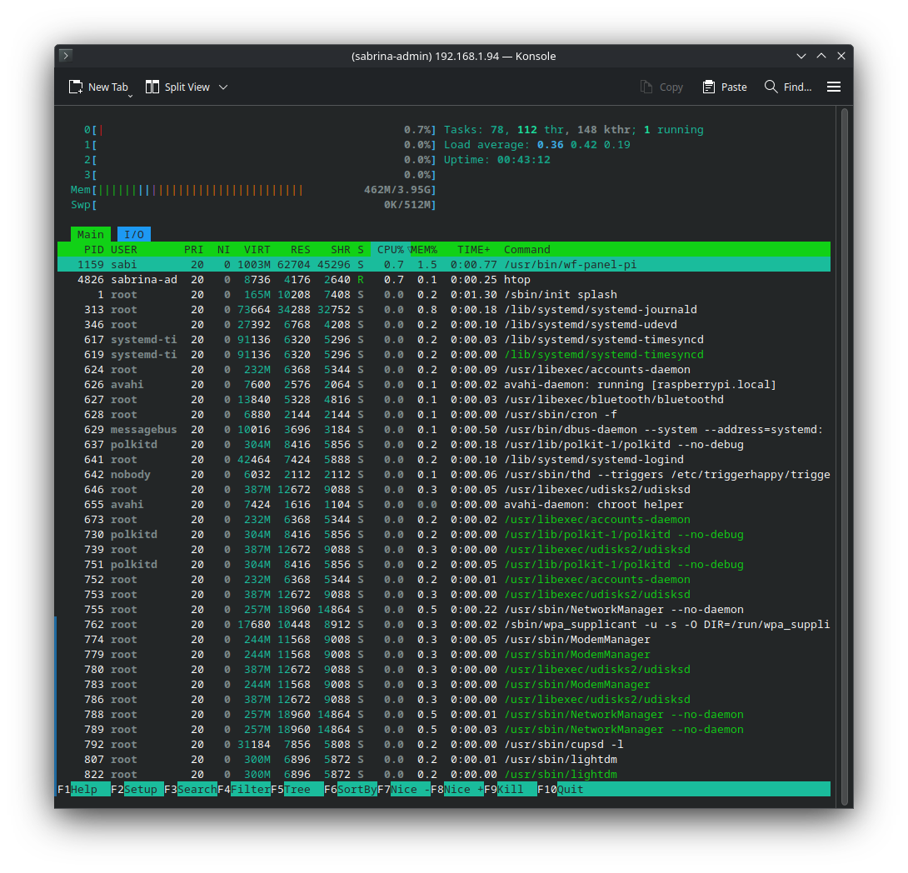
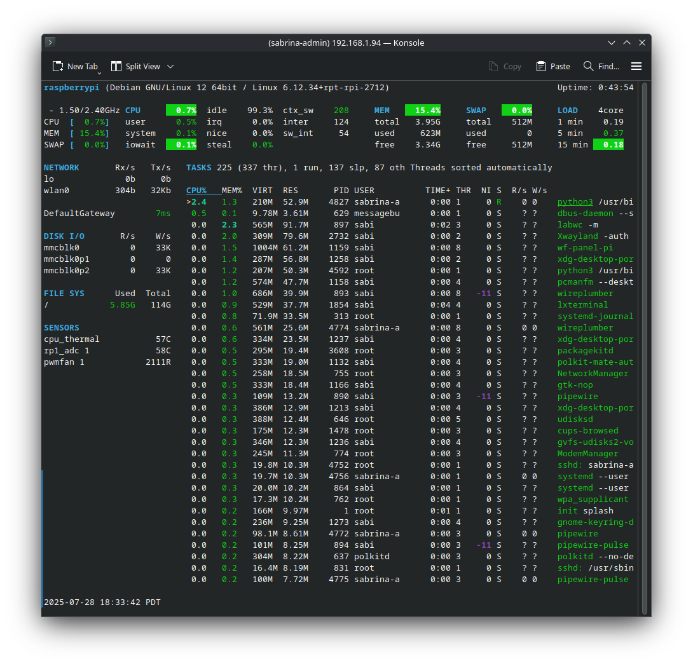
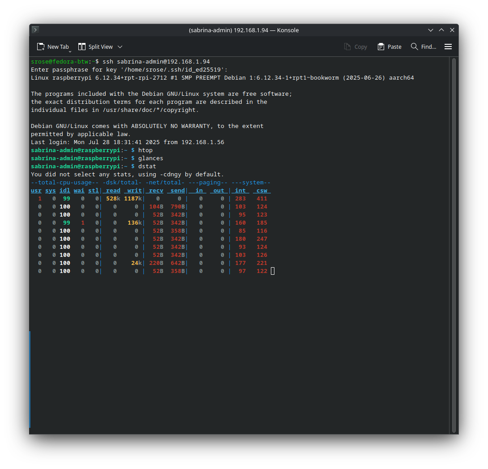
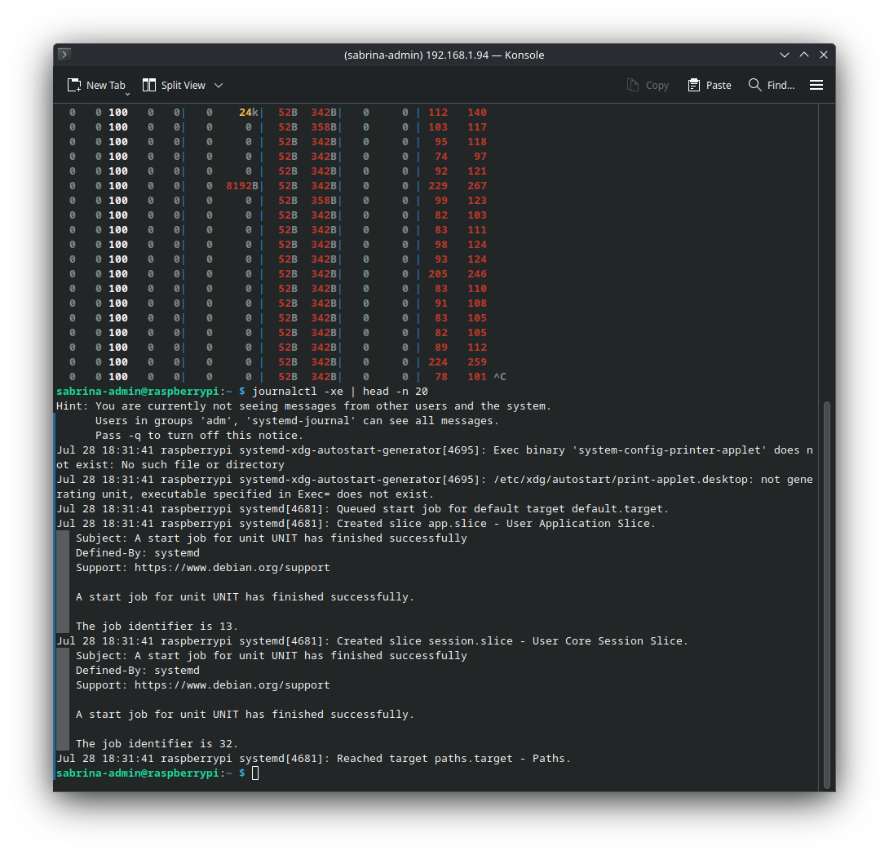
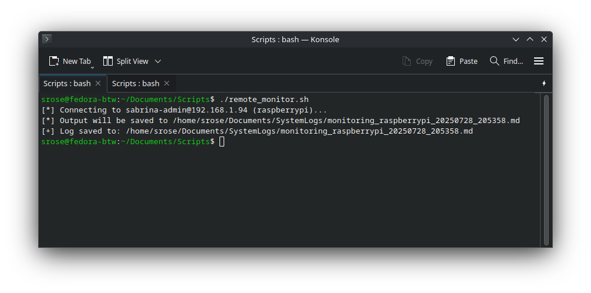
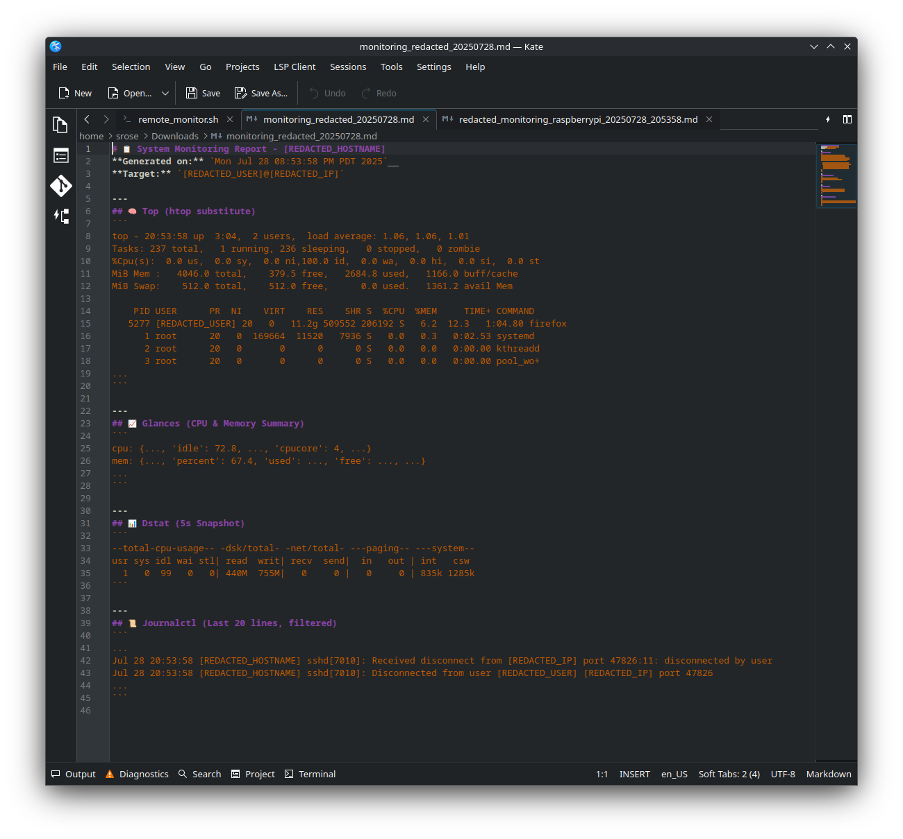

# System Monitoring & Remote Logging Lab Report

## Project Title
Remote Monitoring & Logging via SSH for Raspberry Pi

## Date
2025-07-28

## Author
sabrinaderose (GitHub)

## Repository
https://github.com/sabrinaderose/core-system-monitoring-logs

## Category
Homelab | Configuration | Documentation | Remote Access | System Monitoring

## Related Certifications
- CompTIA A+ (Earned)
- LPI Linux Essentials (Earned)
- Cisco CCNA (Upcoming)

## 🎯 Objective
This project was designed to create a remote monitoring and log capture system using SSH, Glances, htop, dstat, and journalctl to observe Raspberry Pi performance from a separate Fedora system. The primary objectives were:

- Securely gather system health information from a Raspberry Pi 5 via SSH
- Pipe outputs into Markdown logs for readability and export
- Automate storage of those logs into an accessible and organized directory
- Create a script that can be adapted for future multi-host monitoring
- Document the process with professional formatting for GitHub and job readiness

## 🖥️ Environment & Tooling

### 🔧 Hardware Used
- **Remote Target:** Raspberry Pi 5 (4GB RAM), running Raspberry Pi OS 64-bit (Bookworm)
- **Client System:** Fedora Linux Workstation (host), used to execute scripts and store logs
- **Peripherals:** iPistBit 7" Touchscreen (1024x600 IPS), Vilros USB keyboard with touchpad, microSD (128GB), USB-C 27W power supply

### 💻 Software Environment

**Raspberry Pi:**
- OS: Debian GNU/Linux 12 (Bookworm)
- Kernel: 6.1.34-v8+
- Services: SSH, Glances, journalctl
- Users: sabrina-admin, sabi

**Fedora Client:**
- OS: Fedora Linux 42 Workstation
- Shell: Bash 5.2+
- Editor: Kate (for reviewing logs and markdown)
- Tools: OpenSSH, notify-send, Markdown

## 🛜  Network Topology
```
[ Fedora Workstation (192.168.X.X) ]
          |
          | (via SSH)
          V
[ Raspberry Pi 5 (192.168.X.X) ]
```

## 🔧 Step-by-Step Process

### 🔹 Phase 1: Preparation
- Created SSH key for passwordless access to the Pi
- Installed glances, htop, and dstat on the Raspberry Pi
- Verified SSH access with agent forwarding
- Created initial log output structure in markdown

### 🔹 Phase 2: Configuration
Developed a shell script `remote_monitor.sh` to:
- Connect to remote Pi over SSH
- Run system health tools (top, glances, dstat, journalctl)
- Format output into structured Markdown
- Save output to: `~/Documents/SystemLogs/monitoring_<hostname>_<timestamp>.md`
- Notify user of completion using notify-send

Example output file: `monitoring_raspberrypi_20250728_205123.md`

### 🔹 Phase 3: Testing
Executed script multiple times to validate:
- Proper SSH connection and command output
- Log file formatting
- Accurate hostname resolution
- Log storage path and timestamped naming

Sample console output (see **Figure E**)  
Successfully rendered markdown logs using Kate (see **Figure F**)

### 🔹 Phase 4: Troubleshooting
- Observed temporary SSH hang behavior
- Confirmed resolution by launching ssh-agent, adding the correct key, and removing conflicting permissions on `.ssh` configs
- Reviewed journalctl errors and suppressed non-critical system messages (e.g., WirePlumber)

## 🔍 Analysis & Reflection

**Successes:**
- Clean integration of system commands into markdown output
- Logs now structured and timestamped for easy audit trail
- Reusable, scalable script for multi-host monitoring with hostnames

**Lessons Learned:**
- SSH must be carefully managed, especially when chaining commands
- Markdown logs are both human-readable and Git-friendly
- Glances must be manually scoped to stdout metrics to avoid overload

## ✅ Final Outcome
- Fully functional and repeatable script to monitor Raspberry Pi remotely
- Logs are automatically saved, readable, and include filtered logs and stats
- Project documents both technical skill and real-world sysadmin logic
- Estimated time invested: 4.5 hours across setup, scripting, testing, and documentation

## 📸 Figures and Verification

> The following images are embedded below for clarity, documentation, and reference within this lab.

---

### **Figure A: htop output from Raspberry Pi via SSH**  



*Highlighted process table, memory usage, and CPU stats.*

---

### **Figure B: glances output**  



*Shows CPU/Memory summary and thermal sensors.*

---

### **Figure C: dstat snapshot**  



*Captures 5s CPU, disk, and I/O snapshot for quick performance benchmarking.*

---

### **Figure D:  Filtered journalctl logs**  



*Displays last 20 lines of system logs, excluding noise.*

---

### **Figure E: Console run of script on Fedora**  



*Demonstrates automatic output generation and host tagging.*

---

### **Figure F:  Redacted markdown report in Kate editor**  



*Final .md log file showing structured and secure output.*

---

## Key Files and Scripts
- `remote_monitor.sh` – Main script to execute remote monitoring
- `monitoring_<hostname>_<timestamp>.md` – Log output file
- `/Documents/Scripts/` – Script storage
- `/Documents/SystemLogs/` – Log output directory

---

## Interview/Resume Summary (STAR Format)
**Situation:** Needed a remote monitoring solution for Raspberry Pi to observe health metrics and log changes over time.  
**Task:** Create a tool to connect via SSH, extract metrics, and save logs in a structured format.  
**Action:** Developed a Bash script that automates SSH login, runs common sysadmin tools (htop, glances, dstat, journalctl), and exports clean markdown logs.  
**Result:** Produced scalable monitoring solution used to capture and document remote system performance, demonstrating scripting, SSH configuration, and logging best practices.

---

## References & Resources
- https://github.com/nicolargo/glances
- https://man7.org/linux/man-pages/man1/dstat.1.html
- https://www.freedesktop.org/software/systemd/man/journalctl.html
- https://wiki.archlinux.org/title/SSH_keys
- https://wiki.archlinux.org/title/System_monitoring
